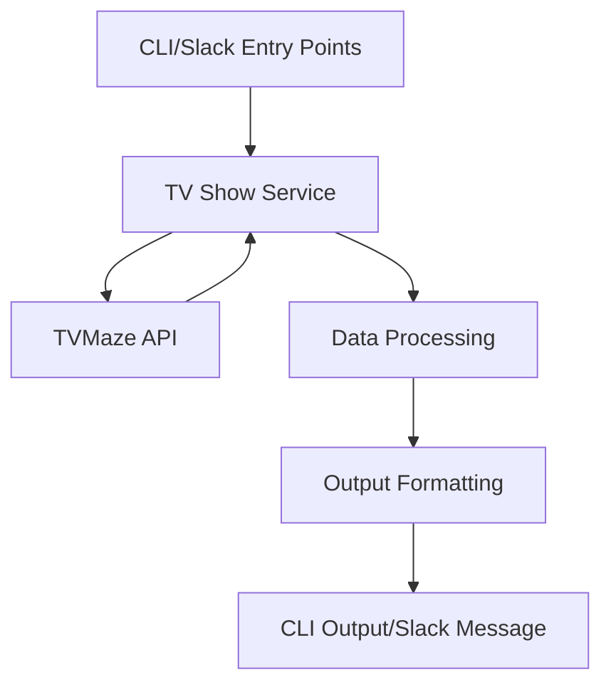

# What's On TV - Technical Specification

## Project Overview

What's On TV is a TypeScript-based CLI application and Slack notification service that helps users track TV show schedules. It integrates with the TVMaze API to fetch show information and can be used either as a command-line tool for immediate queries or as a scheduled service that sends daily notifications to Slack.

## Goals and Objectives

### Primary Goals
1. Provide real-time access to TV show schedules through a CLI interface
2. Deliver automated daily show notifications via Slack
3. Support flexible filtering of shows based on user preferences
4. Maintain high code quality and type safety through TypeScript

### Non-Goals
1. Providing a web interface
2. Supporting multiple notification platforms (focused on Slack)
3. Storing historical show data
4. User authentication/authorization

## Architecture

### System Components

1. **CLI Interface** (`src/cli.ts`)
   - Handles command-line argument parsing using `yargs`
   - Provides immediate feedback for show queries
   - Supports various filtering options

2. **Slack Notifier** (`src/slack.ts`)
   - Manages scheduled notifications using `node-schedule`
   - Formats and sends messages to Slack
   - Handles retry logic and error reporting

3. **TV Show Service** (`src/services/tvShowService.ts`)
   - Core business logic for fetching and processing show data
   - Implements filtering and sorting functionality
   - Handles API communication with TVMaze

4. **Configuration Management** (`src/config.ts`)
   - Manages user preferences and settings
   - Supports both default and user-override configurations
   - Handles environment variables for sensitive data

### Data Flow

## Technical Decisions

### Language Choice
- **TypeScript**: Chosen for type safety, better developer experience, and improved maintainability
- **ESM Modules**: Modern JavaScript module system for better tree-shaking and future compatibility

### External Dependencies
1. **API Communication**
   - `axios`: Robust HTTP client with TypeScript support
   - No API key required for TVMaze

2. **CLI Interface**
   - `yargs`: Feature-rich command-line argument parser
   - `chalk`: Terminal string styling

3. **Slack Integration**
   - `@slack/web-api`: Official Slack client
   - `node-schedule`: Cron-like job scheduler

### Type System

1. **Show Types** (`src/types/tvmaze.ts`)
   - Comprehensive type definitions for TVMaze API responses
   - Custom types for internal show representation
   - Strong typing for filtering options

2. **Configuration Types** (`src/types/config.ts`)
   - Type-safe configuration options
   - Environment variable definitions
   - Slack configuration types

## Testing Strategy

1. **Unit Tests**
   - Jest as the testing framework
   - Focus on business logic in services
   - Mocked external dependencies
   - Comprehensive test coverage:
     - Time formatting edge cases
     - Show filtering by country, type, network, genre, and language
     - Platform-based country detection
     - Network name normalization

2. **Integration Tests**
   - API integration tests with TVMaze
   - Slack message delivery verification
   - Configuration loading tests
   - Mock adapter for HTTP requests

3. **Test Coverage**
   - Minimum 80% branch coverage requirement
   - Current coverage:
     - Statements: 93.87%
     - Branches: 85.32%
     - Functions: 90.90%
     - Lines: 93.02%
   - Mock console output in tests
   - Error handling verification

## Code Style and Quality

1. **Formatting Rules**
   - ESLint for code style
   - Prettier for formatting with specific rules:
     - Single quotes for strings
     - Required semicolons
     - No trailing commas
     - 2-space indentation
     - 100 character line width

2. **TypeScript Configuration**
   - Strict mode enabled
   - ESM modules
   - Type safety for external APIs
   - Comprehensive type definitions

3. **Code Organization**
   - Clear separation of concerns
   - Well-documented public APIs
   - Private functions for internal logic
   - Integration tests through public APIs

## Error Handling

1. **API Errors**
   - Graceful handling of TVMaze API failures
   - Retry logic for transient failures
   - Clear error messages for users

2. **Configuration Errors**
   - Validation of user configuration
   - Sensible defaults for missing options
   - Environment variable checking

3. **Runtime Errors**
   - Graceful degradation on failures
   - Detailed error logging
   - User-friendly error messages

## Future Considerations

### Potential Enhancements
1. Support for additional TV data sources
2. More notification platforms (Discord, Email)
3. Personal watch list management
4. Show recommendations based on preferences
5. Integration with streaming service availability

### Technical Debt
1. Regular dependency updates
2. Monitoring of TVMaze API changes
3. Performance optimization for large result sets
4. Enhanced error reporting

## Development Workflow

1. **Version Control**
   - Git for source control
   - Feature branches for development
   - Pull request workflow

2. **Code Quality**
   - ESLint for code style
   - Prettier for formatting
   - TypeScript strict mode

3. **Deployment**
   - npm scripts for common tasks
   - Build process using `tsc`
   - Clean build directory management

## Documentation

1. **Code Documentation**
   - TSDoc comments for public APIs
   - Clear function and type documentation
   - Examples in comments for complex logic

2. **Project Documentation**
   - README.md for user guide
   - TechSpec.md for technical documentation
   - Inline comments for implementation details

## Maintenance

1. **Dependency Management**
   - Regular updates of dependencies
   - Security vulnerability monitoring
   - Compatibility testing

2. **Monitoring**
   - Error logging
   - Usage statistics
   - API response times

3. **Updates**
   - Regular review of TVMaze API changes
   - TypeScript and Node.js version updates
   - Security patches

## Version Constraints and Dependencies

This section tracks specific version constraints and dependencies that require careful consideration during updates.

### ESLint Ecosystem
- **ESLint**: Using v8.x.x (not v9) due to:
  - Better compatibility with TypeScript ecosystem
  - Integration with jest-runner-eslint
  - Stable support for our code style preferences
  - Related dependencies:
    - `@typescript-eslint/parser`: Requires ESLint v8
    - `@typescript-eslint/eslint-plugin`: Requires ESLint v8
    - `eslint-config-prettier`: Compatible with ESLint v8

### TypeScript
- **TypeScript**: Using v5.5.x due to:
  - Compatibility with @typescript-eslint tooling
  - Support range: >=4.7.4 <5.6.0
  - Affects:
    - Type checking
    - ESLint integration
    - Jest type definitions

### Testing Framework
- **Jest**: Using v29.x.x with:
  - jest-runner-eslint for linting integration
  - ts-jest for TypeScript support
  - Configured with separate projects for tests and linting

### Version Update Strategy
1. **Major Version Updates**
   - Evaluate ecosystem compatibility before upgrading
   - Test all integrations thoroughly
   - Update related dependencies in sync
   - Document any breaking changes

2. **Compatibility Checks**
   - ESLint + TypeScript compatibility
   - Jest runner compatibility
   - Code style enforcement consistency

3. **Update Assessment**
   - Security implications
   - Feature requirements
   - Breaking changes
   - Integration impacts
