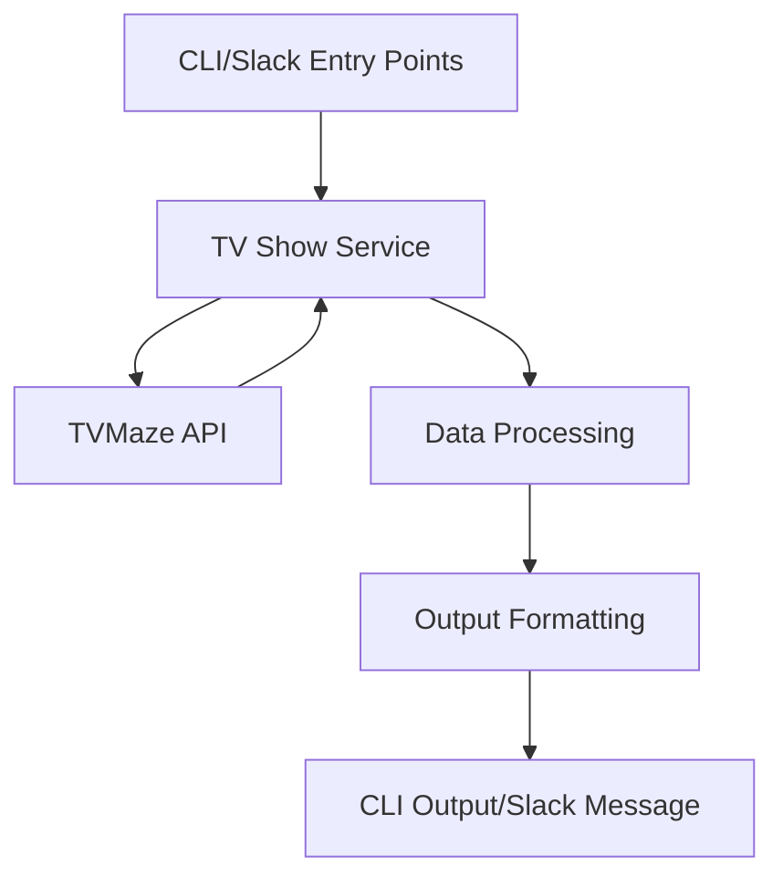

# What's On TV - Technical Specification

## Project Overview

What's On TV is a TypeScript-based CLI application and Slack notification service that helps users track TV show schedules. It integrates with the TVMaze API to fetch show information and can be used either as a command-line tool for immediate queries or as a scheduled service that sends daily notifications to Slack.

## Goals and Objectives

### Primary Goals
1. Provide real-time access to TV show schedules through a CLI interface
2. Deliver automated daily show notifications via Slack
3. Support flexible filtering of shows based on user preferences
4. Maintain high code quality and type safety through TypeScript

### Non-Goals
1. Providing a web interface
2. Supporting multiple notification platforms (focused on Slack)
3. Storing historical show data
4. User authentication/authorization

## Architecture

### System Components

1. **CLI Interface** (`src/cli.ts`)
   - Handles command-line argument parsing using `yargs`
   - Provides immediate feedback for show queries
   - Supports various filtering options

2. **Slack Notifier** (`src/slack.ts`)
   - Manages scheduled notifications using `node-schedule`
   - Formats and sends messages to Slack
   - Handles retry logic and error reporting

3. **TV Show Service** (`src/services/tvShowService.ts`)
   - Core business logic for fetching and processing show data
   - Implements filtering and sorting functionality
   - Handles API communication with TVMaze

4. **Configuration Management** (`src/config.ts`)
   - Manages user preferences and settings
   - Supports both default and user-override configurations
   - Handles environment variables for sensitive data

### Data Flow



## Technical Decisions

### Language Choice
- **TypeScript**: Chosen for type safety, better developer experience, and improved maintainability
- **ESM Modules**: Modern JavaScript module system for better tree-shaking and future compatibility

### External Dependencies
1. **API Communication**
   - `axios`: Robust HTTP client with TypeScript support
   - No API key required for TVMaze

2. **CLI Interface**
   - `yargs`: Feature-rich command-line argument parser
   - `chalk`: Terminal string styling

3. **Slack Integration**
   - `@slack/web-api`: Official Slack client
   - `node-schedule`: Cron-like job scheduler

### Type System

1. **Show Types** (`src/types/tvmaze.ts`)
   - Comprehensive type definitions for TVMaze API responses
   - Custom types for internal show representation
   - Strong typing for filtering options

2. **Configuration Types** (`src/types/config.ts`)
   - Type-safe configuration options
   - Environment variable definitions
   - Slack configuration types

## Testing Strategy

1. **Unit Tests**
   - Jest v29.x.x as testing framework with jest-runner-eslint integration
   - Focus on business logic in services
   - Mocked external dependencies
   - Comprehensive test coverage:
     - Time formatting edge cases
     - Show filtering by country, type, network, genre, and language
     - Platform-based country detection
     - Network name normalization

2. **Integration Tests**
   - API integration tests with TVMaze
   - Slack message delivery verification
   - Configuration loading tests
   - Mock adapter for HTTP requests

3. **Test Coverage**
   - Target: 80% coverage across all metrics
   - Current coverage:
     - Statements: 61.97%
     - Branches: 64.37%
     - Functions: 53.48%
     - Lines: 62.98%
   - Interim threshold: 50% while improving coverage
   - Mock console output in tests
   - Error handling verification

## Code Style and Quality

1. **Formatting and Linting**
   - ESLint v9.x.x as single source of truth for code quality and formatting
   - No Prettier to avoid conflicts
   - TypeScript-specific rules:
     - Strict boolean expressions
     - No implicit conversions
     - Explicit function return types
     - No floating promises
     - No non-null assertions (except in tests)
   - Formatting standards:
     - Single quotes for strings
     - Required semicolons
     - No trailing commas
     - 2-space indentation
     - 100 character line width

2. **TypeScript Configuration**
   - TypeScript 5.5.2 with full ESM support
   - NodeNext module resolution for improved import handling
   - ES2022 target for modern JavaScript features
   - Strict mode enabled
   - Type safety for external APIs
   - Comprehensive type definitions
   - Version constraints: >=4.7.4 <5.6.0 for ESLint tooling compatibility

3. **ESM Implementation**
   - Native ESM modules with `"type": "module"` in package.json
   - Node.js register API for TypeScript execution
   - Explicit `.js` extensions in import statements for NodeNext compatibility
   - Import path URL resolution using `import.meta.url`

4. **Code Organization**
   - Clear separation of concerns
   - Well-documented public APIs
   - Private functions for internal logic
   - Integration tests through public APIs

## Testing & Mocking Standards

### 1. Jest Configuration
- Using Jest v29.x.x with ts-jest for TypeScript support
- ES modules support enabled with `"type": "module"` in package.json
- TypeScript configuration aligned with ESLint standards
- Experimental VM modules for ESM testing
- Warning suppression for cleaner test output

### 2. Mocking Approaches

#### Module Mocking
```typescript
// Preferred: Use jest.unstable_mockModule for ES modules
jest.unstable_mockModule('./path/to/module.js', () => ({
  functionName: jest.fn(() => returnValue)
}));

// Alternative: Use jest.spyOn for class methods and global objects
jest.spyOn(object, 'method').mockImplementation(() => returnValue);
```

#### Common Pitfalls
1. **ES Module Extensions**: Always include `.js` extension in imports and mocks
   ```typescript
   // Correct
   import { function } from './module.js';
   jest.unstable_mockModule('./module.js', ...);

   // Incorrect
   import { function } from './module';
   jest.mock('./module', ...);
   ```

2. **Mock Timing**: Module mocks must be defined before any imports
   ```typescript
   // Correct
   jest.unstable_mockModule('./module.js', ...);
   import { function } from './module.js';

   // Incorrect
   import { function } from './module.js';
   jest.unstable_mockModule('./module.js', ...);
   ```

3. **Mock Cleanup**: Reset mocks in beforeEach to prevent test pollution
   ```typescript
   beforeEach(() => {
     jest.resetAllMocks();
   });
   ```

### 3. Testing Best Practices

#### Test Structure
- Mirror source code structure in test files
- Group related tests using describe blocks
- Use clear test descriptions following the pattern:
  ```typescript
  describe('componentName', () => {
    describe('functionName', () => {
      test('should describe expected behavior', () => {
        // Test implementation
      });
    });
  });
  ```

#### Assertions
- Prefer explicit assertions over snapshot testing
- Use type-safe assertions when possible
- Test both success and error paths

#### Mock Data
- Define reusable mock data at the top of test files
- Use TypeScript interfaces to ensure mock data correctness
- Keep mock data minimal and focused on test requirements

### 4. Common Mocking Scenarios

#### External Dependencies
```typescript
// API Clients (using axios-mock-adapter)
const mock = new MockAdapter(api);
mock.onGet('/path').reply(200, responseData);

// Utility Functions
jest.unstable_mockModule('../../utils/ids.js', () => ({
  generateId: jest.fn(() => 'mock-id')
}));

// Date/Time
jest.spyOn(global.Date, 'now').mockImplementation(() => 1234567890);
```

#### Internal Dependencies
```typescript
// Class Methods
jest.spyOn(instance, 'method').mockImplementation(() => result);

// Event Handlers
jest.spyOn(element, 'addEventListener');
```

### 5. Coverage Requirements
- Maintain 80% coverage for:
  - Statements
  - Branches
  - Functions
  - Lines
- Exclude test files from coverage reports
- Document any intentionally uncovered code

### 6. Performance
- Mock heavy operations in unit tests
- Use setup/teardown hooks efficiently
- Keep test execution time under 5 seconds per file

### 7. Debugging
- Use `test.only()` for focusing on specific tests
- Enable Jest's verbose mode for detailed output
- Utilize Jest's --detectOpenHandles for async issues

## Development Workflow

1. **Local Development**
   - TypeScript compilation via `tsc --noEmit`
   - ESLint for code quality and formatting
   - Jest for unit testing
   - Pre-commit hooks:
     - ESLint with --fix via lint-staged
     - Jest tests on changed files without coverage checks
   - Common commands:
     - `npm run ci`: Run type checking, tests, and linting
     - `npm test`: Run tests
     - `npm run lint`: Run ESLint
     - `npm run lint:fix`: Run ESLint with auto-fix
     - `npm run test:watch`: Run tests in watch mode
     - `npm run test:changed`: Run tests on changed files only

## Documentation

1. **Code Documentation**
   - TSDoc comments for public APIs
   - Clear function and type documentation
   - Examples in comments for complex logic

2. **Project Documentation**
   - README.md for user guide
   - TechSpec.md for technical documentation
   - Inline comments for implementation details

## Maintenance

1. **Dependency Management**
   - Automated dependency updates via Dependabot
     - Weekly checks for npm dependencies
     - Monthly checks for GitHub Actions
     - Intelligent grouping of related dependencies
     - Automated PR creation with appropriate labels
   - Version constraints and compatibility management
     - Minor and patch updates automated
     - Major updates require manual review
     - Special handling for TypeScript and ESLint ecosystem
   - Security vulnerability monitoring and patching
   - Comprehensive testing for dependency updates

2. **Monitoring**
   - Error logging
   - Usage statistics
   - API response times

3. **Updates**
   - Regular review of TVMaze API changes
   - TypeScript and Node.js version updates
   - Security patches

## Version Constraints and Dependencies

This section tracks specific version constraints and dependencies that require careful consideration during updates.

### ESLint Ecosystem
- **ESLint**: Using v9.x.x with:
  - Flat config format (eslint.config.js)
  - Direct integration with TypeScript
  - Single source of truth for code quality and formatting
  - Related dependencies:
    - `@eslint/js`: v9.x.x for JavaScript configurations
    - `@typescript-eslint/parser`: v8.x.x for TypeScript parsing
    - `@typescript-eslint/eslint-plugin`: v8.x.x for TypeScript-specific rules
  - **Compatibility Notes**:
    - TypeScript ESLint plugins have peer dependencies on ESLint v8, but work with v9
    - Peer dependency warnings are expected and can be safely ignored
    - Version mismatches between parser and plugin can cause issues
  - **Update Strategy**:
    - Dependabot configured to group all ESLint-related updates together
    - Minor/patch updates automated via weekly PRs
    - Major version updates require manual review and testing
    - Always update parser and plugin together to maintain compatibility

### TypeScript
- **TypeScript**: Using v5.5.2 with full ESM support
- **NodeNext module resolution**: For improved import handling
- **ES2022 target**: For modern JavaScript features
- **Strict mode enabled**: For type safety and best practices
- **Type safety for external APIs**: For robust error handling
- **Comprehensive type definitions**: For maintainable codebase
- **Version constraints**: >=4.7.4 <5.6.0 for ESLint tooling compatibility

### Testing Framework
- **Jest**: Using v29.x.x with:
  - ts-jest for TypeScript support
  - Configured with separate projects for unit tests
  - Coverage reporting and thresholds

### Version Update Strategy
1. **Major Version Updates**
   - Evaluate ecosystem compatibility before upgrading
   - Test all integrations thoroughly
   - Update related dependencies in sync
   - Document any breaking changes

2. **Compatibility Checks**
   - ESLint + TypeScript compatibility
   - Jest runner compatibility
   - Code style enforcement consistency

3. **Update Assessment**
   - Security implications
   - Feature requirements
   - Breaking changes
   - Integration impacts

## Future Improvements

### Code Quality
1. Error Handling
   - Add custom error types for better error handling in `tvShowService.ts`
   - Implement structured error logging
   - Add error recovery strategies for API failures

2. Code Organization
   - Extract complex filtering logic into dedicated utility functions
   - Consider implementing a service layer pattern
   - Add examples in comments for complex filtering logic

### Testing
1. Configuration
   - Extract coverage thresholds to constants for easier maintenance
   - Add documentation for ESM-specific Jest settings
   - Consider adding integration test suite

2. Test Organization
   - Group tests by feature/functionality
   - Add more edge cases for error conditions
   - Consider adding performance benchmarks

### Future Considerations

### Potential Enhancements
1. Support for additional TV data sources
2. More notification platforms (Discord, Email)
3. Personal watch list management
4. Show recommendations based on preferences
5. Integration with streaming service availability

### Technical Debt
1. Regular dependency updates
2. Monitoring of TVMaze API changes
3. Performance optimization for large result sets
4. Enhanced error reporting

## Error Handling

1. **API Errors**
   - Graceful handling of TVMaze API failures
   - Retry logic for transient failures
   - Clear error messages for users

2. **Configuration Errors**
   - Validation of user configuration
   - Sensible defaults for missing options
   - Environment variable checking

3. **Runtime Errors**
   - Graceful degradation on failures
   - Detailed error logging
   - User-friendly error messages

## Build and Validation

1. **Continuous Integration**
   - GitHub Actions workflow
   - Single validation job that runs:
     - Type checking
     - ESLint for code quality and formatting
     - Unit tests with coverage
   - Package-lock.json verification
   - Status badge in README

2. **Pre-commit Hooks**
   - Type checking runs first
   - ESLint with --fix via lint-staged
   - Unit tests for changed files without coverage checks
   - Consistent with CI validation

3. **Development Commands**
   - `npm test`: Run tests
   - `npm run type-check`: TypeScript validation
   - `npm run lint`: Run ESLint checks
   - `npm run lint:fix`: Run ESLint with auto-fix
   - `npm run ci`: Full CI validation suite (type-check, test, lint)
   - `npm run test:watch`: Run tests in watch mode
   - `npm run test:changed`: Run tests on changed files only
