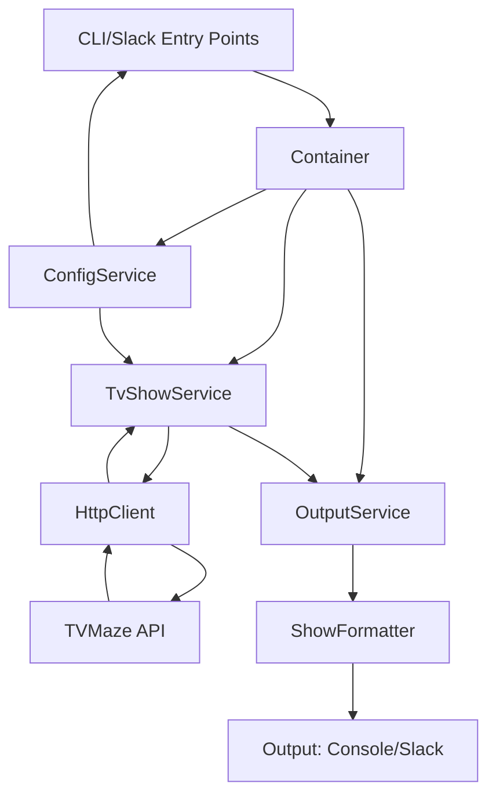

# What's On TV - Technical Specification

## Project Overview

What's On TV is a TypeScript-based CLI application and Slack notification service that helps users track TV show schedules. It integrates with the TVMaze API to fetch show information and can be used either as a command-line tool for immediate queries or as a scheduled service that sends daily notifications to Slack.

## Goals and Objectives

### Primary Goals
1. Provide real-time access to TV show schedules through a CLI interface
2. Deliver automated daily show notifications via Slack
3. Support flexible filtering of shows based on user preferences
4. Maintain high code quality and type safety through TypeScript

### Non-Goals
1. Providing a web interface
2. Supporting multiple notification platforms (focused on Slack)
3. Storing historical show data
4. User authentication/authorization

## Architecture

### System Components

The application follows a clean architecture with clear separation of interfaces and implementations:

1. **Interface Definitions** (`src/interfaces/`)
   - `tvShowService.ts`: Interface for TV show data retrieval
   - `outputService.ts`: Common interface for output services
   - `showFormatter.ts`: Interface for formatting show data
   - `consoleOutput.ts`: Interface for low-level console operations
   - `httpClient.ts`: Interface for HTTP client operations
   - `configService.ts`: Interface for configuration management

2. **Implementations** (`src/implementations/`)
   - `tvMazeServiceImpl.ts`: TVMaze API implementation of TvShowService
   - `fetchHttpClientImpl.ts`: HTTP client implementation using Ky (Fetch API wrapper)
   - `styleServiceImpl.ts`: Styling service implementation
   - Console-specific implementations (`src/implementations/console/`):
     - `consoleOutputImpl.ts`: Implementation of low-level console operations
     - `consoleFormatterImpl.ts`: Console-specific formatting implementation
     - `consoleOutputServiceImpl.ts`: Console output service implementation
     - `consoleConfigServiceImpl.ts`: Console-specific configuration implementation
   - Slack-specific implementations (`src/implementations/slack/`):
     - `slackFormatterImpl.ts`: Slack-specific formatting implementation
     - `slackOutputServiceImpl.ts`: Slack output service implementation
   - Test-specific implementations (`src/implementations/test/`):
     - `testConfigServiceImpl.ts`: Test-specific configuration implementation
     - `plainStyleServiceImpl.ts`: Unstyled formatting for tests
     - `mockConsoleOutputImpl.ts`: Mock console output for testing

3. **Utilities** (`src/utils/`)
   - `dateUtils.ts`: Date-related utility functions
   - `showUtils.ts`: Show data manipulation functions
   - `styleUtils.ts`: Styling utility functions
   - `formatting.ts`: General text formatting utilities
   - `ids.ts`: ID generation utilities
   - `tvMazeUtils.ts`: TVMaze API specific utility functions

4. **Entry Points**
   - `src/cli.ts`: Command-line interface entry point
   - `src/slack.ts`: Slack notification service entry point

5. **Configuration Management** (`src/types/configTypes.ts`)
   - Defines configuration data structures
   - Supports both default and user-override configurations
   - Handles environment variables for sensitive data

### Dependency Injection

The application uses tsyringe for dependency injection:

1. **Container Setup** (`src/container.ts`)
   - Registers all services with their interfaces
   - Uses singleton pattern for stateful services
   - Configures dependencies for both console and Slack implementations
   - Registers appropriate ConfigService implementation based on context

2. **Injectable Services**
   - All service implementations are decorated with `@injectable()`
   - Dependencies are injected through constructor parameters
   - Clear separation between interfaces and implementations

3. **Service Resolution**
   - Entry points resolve services from the container
   - No direct instantiation of services outside the container
   - Consistent use of dependency injection throughout the application

### Data Flow



## Technical Decisions

### Language Choice
- **TypeScript**: Chosen for type safety, better developer experience, and improved maintainability
- **ESM Modules**: Modern JavaScript module system for better tree-shaking and future compatibility

### External Dependencies
1. **API Communication**
   - `ky`: Robust HTTP client with TypeScript support and Fetch API wrapper
   - No API key required for TVMaze

2. **CLI Interface**
   - `yargs`: Feature-rich command-line argument parser
   - `chalk`: Terminal string styling

3. **Slack Integration**
   - `@slack/web-api`: Official Slack client
   - `node-schedule`: Cron-like job scheduler

4. **Dependency Injection**
   - `tsyringe`: Lightweight DI container with TypeScript support
   - Decorators for injectable services
   - Container-based service resolution

### Type System

1. **Show Types** (`src/types/tvmazeModel.ts`)
   - Comprehensive type definitions for TVMaze API responses
   - Custom types for internal show representation
   - Strong typing for filtering options

2. **Configuration Types** (`src/types/configTypes.ts`)
   - Type-safe configuration options
   - Environment variable definitions
   - Slack configuration types
   - Separation of show options and CLI options

3. **Interface Definitions**
   - Clear interface definitions for all services
   - Consistent naming conventions
   - Proper separation of concerns

## Testing Strategy

1. **Unit Tests**
   - Jest v29.x.x as testing framework with jest-runner-eslint integration
   - Focus on business logic in services
   - Mocked external dependencies
   - Comprehensive test coverage:
     - Time formatting edge cases
     - Show filtering by country, type, network, genre, and language
     - Platform-based country detection
     - Network name normalization

2. **Integration Tests**
   - API integration tests with TVMaze
   - Slack message delivery verification
   - Configuration loading tests
   - Mock adapter for HTTP requests

3. **Test Coverage**
   - Target: 80% coverage across all metrics
   - Current coverage:
     - Statements: 61.97%
     - Branches: 64.37%
     - Functions: 53.48%
     - Lines: 62.98%
   - Interim threshold: 50% while improving coverage
   - Mock console output in tests
   - Error handling verification

## Code Style and Quality

1. **Formatting and Linting**
   - ESLint v9.x.x as single source of truth for code quality and formatting
   - No Prettier to avoid conflicts
   - TypeScript-specific rules:
     - Strict boolean expressions
     - No implicit conversions
     - Explicit function return types
     - No floating promises
     - No non-null assertions (except in tests)
   - Formatting standards:
     - Single quotes for strings
     - Required semicolons
     - No trailing commas
     - 2-space indentation
     - 100 character line width

2. **TypeScript Configuration**
   - TypeScript 5.5.2 with full ESM support
   - NodeNext module resolution for improved import handling
   - ES2022 target for modern JavaScript features
   - Strict mode enabled
   - Type safety for external APIs
   - Comprehensive type definitions
   - Version constraints: >=4.7.4 <5.6.0 for ESLint tooling compatibility

3. **ESM Implementation**
   - Native ESM modules with `"type": "module"` in package.json
   - Node.js register API for TypeScript execution
   - Explicit `.js` extensions in import statements for NodeNext compatibility
   - Import path URL resolution using `import.meta.url`

4. **Code Organization**
   - Clear separation of interfaces and implementations
   - Consistent naming conventions (*Impl.ts suffix for implementations)
   - Platform-specific code in dedicated directories
   - Well-documented public APIs
   - Private functions for internal logic
   - Integration tests through public APIs

## Testing & Mocking Standards

### 1. Jest Configuration
- Using Jest v29.x.x with ts-jest for TypeScript support
- ES modules support enabled with `"type": "module"` in package.json
- TypeScript configuration aligned with ESLint standards
- Experimental VM modules for ESM testing
- Warning suppression for cleaner test output

### 2. Mocking Approaches

#### Module Mocking
```typescript
// Preferred: Use jest.unstable_mockModule for ES modules
jest.unstable_mockModule('./path/to/module.js', () => ({
  functionName: jest.fn(() => returnValue)
}));

// Alternative: Use jest.spyOn for class methods and global objects
jest.spyOn(object, 'method').mockImplementation(() => returnValue);
```

#### Common Pitfalls
1. **ES Module Extensions**: Always include `.js` extension in imports and mocks
   ```typescript
   // Correct
   import { function } from './module.js';
   jest.unstable_mockModule('./module.js', ...);

   // Incorrect
   import { function } from './module';
   jest.mock('./module', ...);
   ```

2. **Mock Timing**: Module mocks must be defined before any imports
   ```typescript
   // Correct
   jest.unstable_mockModule('./module.js', ...);
   import { function } from './module.js';

   // Incorrect
   import { function } from './module.js';
   jest.unstable_mockModule('./module.js', ...);
   ```

3. **Mock Cleanup**: Reset mocks in beforeEach to prevent test pollution

### 3. Dependency Injection in Tests

```typescript
// Create a test container
const container = new Container();

// Register mocks
container.register<TvShowService>('TvShowService', {
  useValue: mockTvShowService
});

// Resolve the service under test
const service = container.resolve<OutputService>('OutputService');
```

## CI/CD Pipeline

### GitHub Actions Workflows

1. **CI Workflow** (`ci.yml`)
   - Triggers:
     - Push to main branch
     - Pull requests to main branch
   - Jobs:
     - Lint: ESLint check
     - Test: Jest tests with coverage
     - Build: TypeScript compilation
   - Environment:
     - Ubuntu latest with Node.js 20.x

2. **Dependency Update Test** (`dependency-update-test.yml`)
   - Triggers:
     - Pull requests that modify package.json or package-lock.json
   - Environment:
     - Ubuntu latest with Node.js 20.x

## Development Environment

### Node.js Version
- Minimum supported: 18.18.0
- Recommended: 20.x
- CI/CD runs on: 20.x

### Package Management
- npm v10.x.x
- package-lock.json committed to repository
- Explicit dependency versions

### Development Tools
- **TypeScript**: v5.5.2 with strict mode
- **ESLint**: v9.x.x with TypeScript-ESLint v8.x.x
- **Jest**: Using v29.x.x with:
  - ts-jest for TypeScript support
  - Configured with separate projects for unit tests
  - Coverage reporting and thresholds

## Deployment

### Production Deployment
- Node.js 18.18.0+ required
- Built JavaScript files in `dist/` directory
- Environment variables for configuration
- PM2 or similar process manager recommended

### Development Setup
1. Clone repository
2. Install dependencies: `npm install`
3. Build TypeScript: `npm run build`
4. Run tests: `npm test`
5. Start CLI: `npm run shows`
6. Start Slack notifier: `npm run slack`

## Maintenance

### Versioning
- Semantic versioning (MAJOR.MINOR.PATCH)
- CHANGELOG.md for version history
- Git tags for releases

### Dependency Updates
- Weekly automated checks via Dependabot
- Grouped updates for related packages
- Automated PR creation for minor and patch updates
- Manual review for major updates

## Future Improvements

1. **Additional Output Platforms**
   - Discord integration
   - Email notifications
   - Web dashboard

2. **Enhanced Features**
   - User preferences storage
   - Show recommendations
   - Episode reminders
   - Personalized notifications

3. **Technical Improvements**
   - Improved test coverage
   - Performance optimizations
   - Containerization
   - Serverless deployment options
